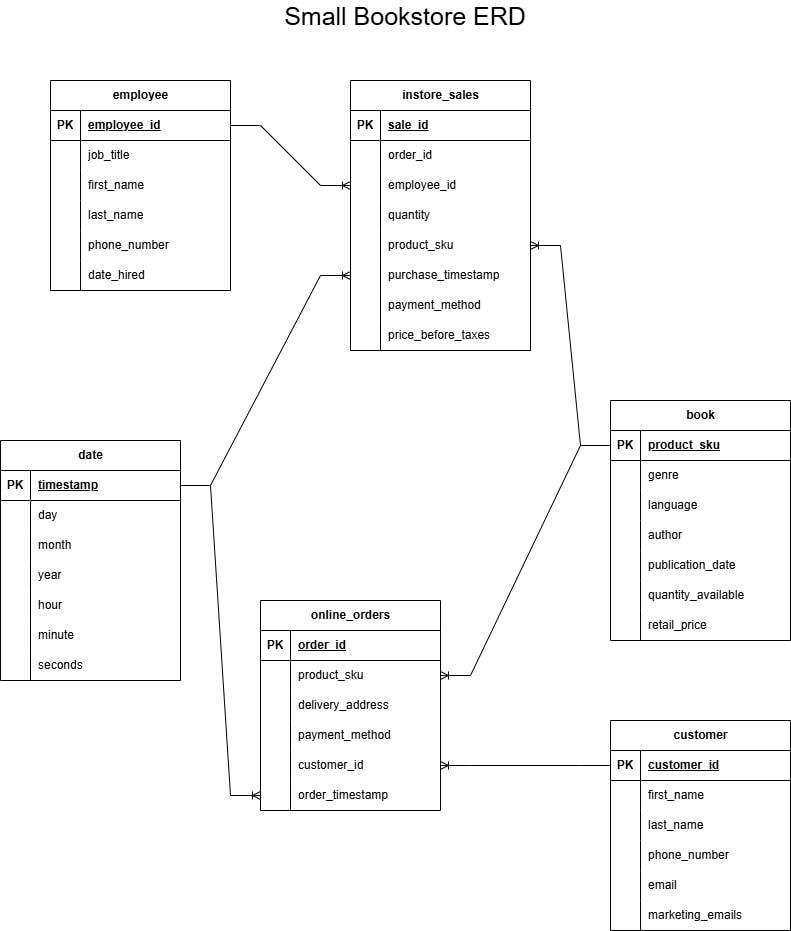

## Assignment 1: Logical Data Model For A Small Bookstore
#### By: Brigitte Yan 

### Question 1
```
This bookstore data model makes the following simplifications:

- Both online and in-store sales involve only a single product SKU. In other words, customers never purchase multiple different items in one transaction; they only buy varying quantities of the same SKU.
- In-store sales do not record customer addresses or phone numbers, as doing so would create an unusual user experience, especially for a small bookstore that may not have a rewards program.
- Online sales, however, record customer information such as address, phone number, etc.
```



### Question 2
```
Data Model with added table for employee shifts:
```


### Question 3

```
Retaining customer addresses, especially in Type 2, has privacy implications:

- Historical addresses remain in the system even after updates, potentially violating data minimization laws, where customers can request data deletion.
- More stored addresses mean more sensitive data at risk in a breach, which could be exploited for fraud or identity theft.
- Retaining old addresses may require explicit consent, and companies must ensure compliance with privacy laws.

Type 1 (overwrite) reduces exposure by only storing the current address but limits tracking of historical changes.
```
#### Type 1 Architecture 
```
In this customer_address table, the a customer's address is overwritten when it's updated, and the old address is erased from the database. 
```


#### Type 2 Architecture 
```
In this customer_address table, new addresses are added and old address are not erased. Instead, old addresses will have a 0 under 'active', and a value in 'end_date.' The primary key is also a composite key consisting of the customer_id and start_date.
```


### Question 4
Review the AdventureWorks Schema [here](https://i.stack.imgur.com/LMu4W.gif)

Highlight at least two differences between it and your ERD. Would you change anything in yours?
```
Observations of the AdventureWorks Schema:
- There are significantly more tables, and they are organized by department 
- Columns may act as both foreign and primary key
- Unsure what U1, U2, etc... mean
- The one-headed arrows seem ambiguous; are they all 1-many?
- Not sure why some table columns are bolded, even though they're not indicated as PK, FK, or U

Things I would change about my ERD based on observations of the AdventureWorks ERD:
- Align my tables better so that their edges match up
- Make sure that all of my arrows have either perfectly horizontal or vertical sections, for consistensy and visual order 
- Group tables by theme/department, using lightly coloured blocks in the background, and label each group 
- Indicate FK in addition to PK 
```
